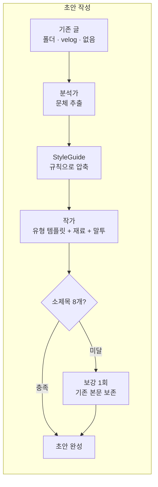
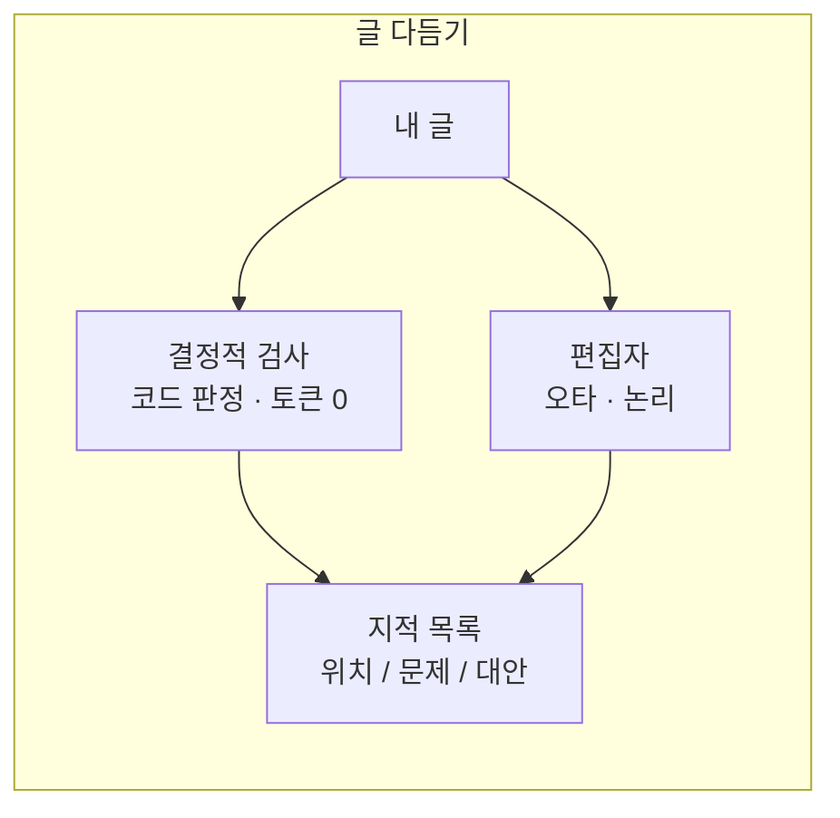

# 초록 (cholog)

> **내 문체 그대로, 다음 글의 초안까지.**

초록은 블로그 글쓰기 에이전트입니다. 기존에 써둔 글에서 **문체를 뽑아** 새 글의
초안을 쓰고, 이미 써둔 글은 **오타와 논리 문제를 짚어**줍니다. 글을 대신
고쳐주지는 않습니다 — 마지막 손질은 필자의 몫이라, 글이 끝까지 내 글로 남습니다.

이름은 초록(抄錄), 요점을 뽑아 적는다는 뜻입니다. 글을 통째로 모델에 넣지 않고
문체를 규칙으로 뽑아 적어두고 그것만 넘긴다는 설계와 맞닿아 있습니다.

## 왜 만들었나

LLM에게 글을 맡기면 세 가지가 무너집니다.

- **말투가 매번 달라집니다.** 초록은 기존 글에서 어투·종결어미·문단 호흡을
  규칙으로 추출해 새 글에 그대로 입힙니다.
- **일반론으로 채워집니다.** "~하면 좋습니다"뿐인 글 대신, 겪은 일·수치·에러
  메시지를 **재료**로 받아 그것을 본문의 최우선 출처로 씁니다.
- **전부 다시 써버립니다.** 검토를 맡기면 고치라고 안 한 문장까지 바뀝니다.
  초록의 편집자는 재작성이 금지되어 있고, 위치·문제·대안 목록만 냅니다.

## 핵심 기능

| 기능 | 설명 |
|---|---|
| ✍️ 문체 학습 | 마크다운 폴더·velog 글에서 문체를 추출해 새 글에 적용 |
| 🌱 처음 쓰는 사람도 OK | 쓴 글이 없으면 기본 문체로 시작 (분석 생략, 토큰 0) |
| 📐 문서 유형 4종 | 학습 중심 / 문제 해결 / 참조 / 설명 — 유형이 글의 구조를 결정 |
| 🗣️ 말투 선택 | 경어체 / 구어체, 처음부터 끝까지 유지 |
| 🧱 재료 기반 작성 | 겪은 일·메모·코드 조각을 넣으면 내 경험이 담긴 글이 나옴 |
| 📏 소제목 최소 8개 보장 | 코드로 세고, 모자라면 기존 본문을 보존한 채 절만 보강 |
| 🔍 글 다듬기 | 결정적 검사(토큰 0) + 편집자 지적 — 고치지 않고 짚어만 줌 |
| 🧮 토큰 계측 | 단계별 사용량을 표로 — 어디에 얼마가 들었는지 투명하게 |

## 동작 방식





원문은 작가에게 전달되지 않습니다. 소스가 무엇이든 `StyleGuide`라는 압축된
규칙으로 수렴한 뒤 넘기기 때문에, 참고할 글이 많아져도 비용이 그만큼 늘지
않습니다.

## 빠른 시작

```bash
# 설치
python3.12 -m venv .venv
.venv/bin/pip install -r requirements.txt
echo "OPENAI_API_KEY=sk-..." > .env

# 백엔드 (8000)
.venv/bin/uvicorn server.api:app --reload --port 8000

# 프론트 (5173)
cd client && npm install && npm run dev
```

http://localhost:5173 에서 시작합니다. 소스 → 주제 → 재료(선택) → 문서 유형 →
말투, 다섯 번의 선택이면 초안이 나옵니다.

### CLI 로 쓰기

```bash
# 초안 작성 — 내 글 폴더의 문체로
.venv/bin/python -m server.cli \
  --path ./sample_posts \
  --topic "도커 빌드 8분을 40초로 줄인 캐시 최적화" \
  --type "문제 해결 문서" --tone "구어체" \
  --material-file ./메모.md \
  --out ./out/draft.md

# 글 다듬기 — 오타·논리 지적만
.venv/bin/python -m server.cli --review ./out/draft.md --type "설명 문서"
```

| 옵션 | 값 |
|---|---|
| `--source` | `local` / `velog` / `template` (쓴 글 없음 — 기본 문체, 분석 생략) |
| `--path` | local 소스의 마크다운 폴더 |
| `--username` | velog 소스의 사용자명 (@ 없이) |
| `--type` | 학습 중심 문서 / 문제 해결 문서 / 참조 문서 / 설명 문서 (`docs/type.md`) |
| `--tone` | 경어체 / 구어체 |
| `--material` | 글의 재료: 겪은 일·메모·코드 조각 (선택) |
| `--material-file` | 재료를 파일에서 읽기 (`--material` 보다 우선) |
| `--review` | 다듬을 마크다운 파일 (이 옵션을 주면 초안 작성은 건너뜀) |

독자와 분량 옵션은 없습니다. 독자는 문서 유형에 담겨 있고, 분량은 유형 템플릿과
"소제목 최소 8개" 규칙이 정합니다.

## API

```bash
.venv/bin/uvicorn server.api:app --reload --port 8000   # 문서: /docs
```

| 메서드 | 경로 | 설명 |
|---|---|---|
| `GET` | `/api/health` | 상태·모델명 |
| `GET` | `/api/options` | 문서 유형/말투 선택지 (프론트가 하드코딩하지 않게) |
| `POST` | `/api/jobs` | 초안 작성 시작 → `202 {job_id}` |
| `GET` | `/api/jobs/{id}` | 폴링: 진행 이벤트 + 완료 시 결과 |
| `GET` | `/api/jobs/{id}/stream` | SSE: `progress` → `result` |
| `POST` | `/api/reviews` | 글 다듬기 시작 → `202 {job_id}` |

```bash
curl -X POST localhost:8000/api/jobs -H 'Content-Type: application/json' -d '{
  "source_type": "local", "path": "./sample_posts",
  "topic": "파이썬 타입 힌트 도입기",
  "doc_type": "설명 문서", "tone": "경어체",
  "material": "mypy 도입 첫 주에 에러 400개. 점진 도입으로 전환한 이야기"
}'
curl -N localhost:8000/api/jobs/<job_id>/stream
```

파이프라인 한 번이 수십 초라 요청을 붙잡지 않고 job 으로 돌립니다. CrewAI
호출이 동기 코드여서 백그라운드 스레드에서 실행하고, 진행 상황만 따로
구독합니다. SSE 가 막히는 환경을 대비해 폴링 경로도 함께 열어 둡니다.

## 프로젝트 구조

```
server/
  pipeline.py      run_pipeline() / run_review() — CLI와 API의 공통 진입점
  agents.py        분석가 / 작가 / 편집자 (CrewAI)
  tasks.py         Task description (ReAct 절차 명시)
  doc_types.py     문서 유형 4종 템플릿 (원본: docs/type.md)
  style_presets.py 쓴 글 없는 사용자용 기본 문체
  checks.py        결정적 검사 (코드 판정, 토큰 0)
  models.py        StyleGuide, EditReport 등 내부 자료구조
  tokens.py        토큰 계측 + 샘플 토큰 예산
  sources/         소스별 로더 (local_md, velog)
  cli.py           CLI 인터페이스
  api.py           FastAPI 앱 (HTTP 처리만, 생성 로직 없음)
  jobs.py          백그라운드 job 실행·진행 이벤트 수집
  schemas.py       HTTP 경계 전용 요청/응답 스키마
client/
  src/App.jsx      두 진입점 (초안 작성 / 글 다듬기)
  src/api.js       서버와 이야기하는 유일한 곳 (SSE, 실패 시 폴링)
  src/components/  Landing, FolderPicker, StepShell, ChoiceList …
sample_posts/      데모용 마크다운 3편
```

## 설계 포인트

- **토큰화** — 문체 샘플을 원문 그대로 넘기지 않고 `StyleGuide` 로 압축한다.
  한국어는 같은 의미에 영어보다 토큰이 1.6배가량 더 든다
  (`scripts/token_compare.py` 로 측정).
- **컨텍스트 윈도우** — 샘플 개수를 '몇 편'이 아니라 '몇 토큰'으로 제한한다.
  `config.STYLE_SAMPLE_TOKEN_BUDGET`, `tokens.select_style_samples()`.
- **Self-Attention** — 한 프롬프트에 분석·작성·검토를 몰아넣지 않고 역할별로
  쪼갰다. 시퀀스 길이에 대해 비용이 N² 로 늘고, 길수록 지시가 희석된다.
- **자기회귀 생성** — 편집자는 전문 재작성이 금지되고 `위치/문제/대안` 목록만
  낸다. 소제목 보강도 기존 본문을 보존한 채 절만 더한다. 매 토큰을 새로
  예측하는 모델에게 전문을 다시 쓰게 하면 고치라고 하지 않은 문장까지 바뀐다.
- **결정적 검사 층** — 코드로 확실히 판정되는 것(코드 문법, 제목 단계, 링크,
  소제목 개수)은 모델에게 묻지 않는다. 자기 출력을 자기에게 검증시키는 것은
  같은 분포에서 다시 뽑는 것과 같다.

## 화면

디자인은 토스 방향을 따랐습니다. 한 화면에 한 가지만 묻고, 선택하면 바로 다음
단계로 넘어갑니다. 문체 분석 결과는 초안을 기다리는 동안 먼저 뜨고, 토큰
사용량은 결과 화면 하단 접힌 영역에 있습니다.

기존 글은 **폴더 열기** 버튼으로 브라우저가 직접 읽어 서버로 보냅니다
(`source_type: "upload"`). 경로를 타이핑받지 않는 이유: 사용자가 경로를 외울
이유가 없고, 브라우저는 보안상 실제 경로를 알려주지 않아 경로 방식은 서버와
같은 기계일 때만 성립하기 때문입니다.

## velog 연동 주의

velog 는 공개 API 가 없어서 웹 클라이언트가 쓰는 GraphQL 엔드포인트
(`https://v3.velog.io/graphql`)를 그대로 부릅니다. 예고 없이 바뀔 수 있습니다.
깨졌을 때는 introspection 으로 현재 스키마를 확인하고
`server/sources/velog.py` 의 쿼리만 고치면 됩니다. velog 가 죽어도 로컬 md
경로는 영향받지 않습니다.

## 로드맵

- [x] 문체 학습 → 초안 생성 → 글 다듬기 (CLI · API · 웹)
- [x] 문서 유형 템플릿 / 말투 / 재료 입력
- [x] 소제목 최소 8개 보장 (코드 검증 + 1회 보강)
- [x] 쓴 글 없는 사용자용 기본 문체 경로
- [x] velog 연동
- [ ] 후속 수정 대화 ("3번째 문단 더 짧게")
