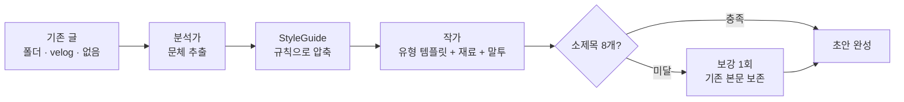

<p align="center">
  <h1 align="center">초록 (cholog)</h1>
  <p align="center">
    내 문체 그대로, 다음 글의 초안까지
    <br />
    기존 글에서 문체를 뽑아 새 글을 쓰고, 써둔 글은 오타·논리를 짚어주는 블로그 글쓰기 에이전트
  </p>
</p>

<p align="center">
  
  
  
  
  
</p>

---

## Overview

**초록**은 블로그 글쓰기의 반복 작업을 대신해주는 글쓰기 에이전트입니다.

기존에 써둔 글에서 **문체를 규칙으로 뽑아** 새 글의 초안을 쓰고, 이미 써둔 글은 **오타와 논리 문제를 짚어**줍니다. 글을 대신 고쳐주지는 않습니다 — 마지막 손질은 필자의 몫이라, 글이 끝까지 내 글로 남습니다.

이름은 초록(抄錄), 요점을 뽑아 적는다는 뜻입니다. 글을 통째로 모델에 넣지 않고 문체를 규칙으로 뽑아 그것만 넘긴다는 설계와 맞닿아 있습니다.

> **개발 기간** : 2025.06 ~ (SKALA 프로젝트)

## Features

- **문체 학습** — 마크다운 폴더·velog 글에서 어투·종결어미·문단 호흡을 규칙으로 추출해 새 글에 적용
- **재료 기반 작성** — 겪은 일·수치·에러 메시지를 넘기면 일반론 대신 내 경험이 담긴 글로 작성
- **문서 유형 4종** — 학습 중심 · 문제 해결 · 참조 · 설명. 유형이 글의 구조를 결정
- **말투 선택** — 경어체 / 구어체, 글 처음부터 끝까지 유지
- **소제목 최소 8개 보장** — 코드로 개수를 세고, 모자라면 기존 본문을 보존한 채 절만 보강
- **글 다듬기** — 결정적 검사(토큰 0) + 편집자 지적. 재작성 없이 위치·문제·대안만 제시
- **처음 쓰는 사람도 OK** — 써둔 글이 없으면 기본 문체로 시작 (분석 생략, 토큰 0)
- **토큰 계측** — 단계별 사용량을 표로, 어디에 얼마가 들었는지 투명하게

## Architecture

원문은 작가에게 전달되지 않습니다. 소스가 무엇이든 `StyleGuide`라는 압축된 규칙으로 수렴한 뒤 넘기기 때문에, 참고할 글이 많아져도 비용이 그만큼 늘지 않습니다.



1. **분석가** — 기존 글에서 재현 가능한 문체 특징을 추출해 `StyleGuide`로 압축합니다.
2. **작가** — 문서 유형 템플릿 + 재료 + 말투로 초안을 씁니다. 소스가 무엇이었는지 모릅니다.
3. **검증·보강** — 소제목 개수를 코드로 세고, 8개에 모자라면 기존 본문을 보존한 채 절만 보강합니다.
4. **편집자**(글 다듬기) — 결정적 검사가 먼저 걸러낸 뒤, 오타·논리만 지적 목록으로 냅니다.

## Tech Stack


## Getting Started

### Prerequisites

- Python 3.12+
- Node.js 18+
- OpenAI API Key

### Installation

```bash
# 백엔드
python3.12 -m venv .venv
.venv/bin/pip install -r requirements.txt
echo "OPENAI_API_KEY=sk-..." > .env
.venv/bin/uvicorn server.api:app --reload --port 8000

# 프론트엔드
cd client && npm install && npm run dev
```

| Service | URL |
|---|---|
| web | http://localhost:5173 |
| api | http://localhost:8000 |
| api docs | http://localhost:8000/docs |

http://localhost:5173 에서 시작합니다. 소스 → 주제 → 재료(선택) → 문서 유형 → 말투, 다섯 번의 선택이면 초안이 나옵니다.

### CLI

```bash
# 초안 작성 — 내 글 폴더의 문체로
.venv/bin/python -m server.cli \
  --path ./sample_posts \
  --topic "도커 빌드 8분을 40초로 줄인 캐시 최적화" \
  --type "문제 해결 문서" --tone "구어체" \
  --material-file ./메모.md \
  --out ./out/draft.md

# 글 다듬기 — 오타·논리 지적만
.venv/bin/python -m server.cli --review ./out/draft.md --type "설명 문서"
```

## API Spec

### 초안 작성

기존 글의 문체를 학습해 새 글 초안을 생성합니다. 오래 걸리는 작업이라 job으로 돌리고 `job_id`를 즉시 반환합니다.

**Request**
```
POST /api/jobs
```

| 필드 | 타입 | 필수 | 설명 |
|---|---|---|---|
| `source_type` | `string` | O | `local` / `upload` / `velog` / `template` |
| `path` | `string` | △ | local 소스: 마크다운 폴더 경로 |
| `username` | `string` | △ | velog 소스: 사용자명 |
| `topic` | `string` | O | 글 주제 |
| `doc_type` | `string` | O | 문서 유형 (4종 중 하나) |
| `tone` | `string` | O | `경어체` / `구어체` |
| `material` | `string` | X | 글의 재료: 겪은 일·메모·코드 조각 |

**Response**

| 필드 | 타입 | 설명 |
|---|---|---|
| `job_id` | `string` | 작업 ID (진행 상황·결과 조회에 사용) |
| `status` | `string` | `running` / `done` / `error` |

**Examples**

```json
// Request
{
  "source_type": "local",
  "path": "./sample_posts",
  "topic": "파이썬 타입 힌트 도입기",
  "doc_type": "설명 문서",
  "tone": "경어체",
  "material": "mypy 도입 첫 주에 에러 400개. 점진 도입으로 전환한 이야기"
}

// Response
{
  "job_id": "ecfbd9242d3b",
  "status": "running"
}
```

진행 상황과 결과는 폴링 또는 SSE로 받습니다.

```
GET  /api/jobs/{job_id}          # 폴링: 진행 이벤트 + 완료 시 결과
GET  /api/jobs/{job_id}/stream   # SSE: progress → result
```

---

### 글 다듬기

이미 써둔 글에서 오타와 논리 문제를 찾아 지적합니다. 글을 고쳐주지는 않습니다.

**Request**
```
POST /api/reviews
```

| 필드 | 타입 | 필수 | 설명 |
|---|---|---|---|
| `draft` | `string` | O | 다듬을 글 (마크다운) |
| `doc_type` | `string` | O | 문서 유형 (4종 중 하나) |

**Response**

| 필드 | 타입 | 설명 |
|---|---|---|
| `job_id` | `string` | 작업 ID |
| `status` | `string` | `running` / `done` / `error` |

조회 경로는 초안 작성과 동일하게 `GET /api/reviews/{job_id}` 및 `/stream`입니다. 결과의 각 지적은 `source`(`auto` 코드 판정 / `model` 모델 판단)로 구분됩니다.

---

### Options

프론트가 선택지를 하드코딩하지 않도록 서버가 문서 유형·말투 목록을 내려줍니다.

```
GET /api/options
```

## External APIs

| 플랫폼 | 용도 | 문서 |
|---|---|---|
| OpenAI | 문체 분석 · 초안 작성 · 편집 (gpt-4o 계열) | [문서 보기](https://platform.openai.com/docs) |
| velog | 사용자 글 목록·본문 조회 (비공식 GraphQL) | `server/sources/velog.py` |

## Project Structure

```
server/
  pipeline.py      run_pipeline() / run_review() — CLI와 API의 공통 진입점
  agents.py        분석가 / 작가 / 편집자 (CrewAI)
  tasks.py         Task description (ReAct 절차 명시)
  doc_types.py     문서 유형 4종 템플릿 (원본: docs/type.md)
  style_presets.py 쓴 글 없는 사용자용 기본 문체
  checks.py        결정적 검사 (코드 판정, 토큰 0)
  models.py        StyleGuide, EditReport 등 내부 자료구조
  tokens.py        토큰 계측 + 샘플 토큰 예산
  sources/         소스별 로더 (local_md, velog)
  api.py           FastAPI 앱 (HTTP 처리만, 생성 로직 없음)
  jobs.py          백그라운드 job 실행·진행 이벤트 수집
client/
  src/App.jsx      두 진입점 (초안 작성 / 글 다듬기)
  src/components/  Landing, FolderPicker, StepShell, ChoiceList …
sample_posts/      데모용 마크다운 3편
```

## Design Notes

- **토큰화** — 문체 샘플을 원문 그대로 넘기지 않고 `StyleGuide`로 압축한다. 한국어는 같은 의미에 영어보다 토큰이 1.6배가량 더 든다.
- **컨텍스트 윈도우** — 샘플을 '몇 편'이 아니라 '몇 토큰'으로 제한한다.
- **Self-Attention** — 분석·작성·검토를 한 프롬프트에 몰지 않고 역할별로 쪼갰다. 길이에 대해 비용이 N²로 늘고, 길수록 지시가 희석된다.
- **자기회귀 생성** — 편집자는 전문 재작성이 금지되고 지적 목록만 낸다. 소제목 보강도 기존 본문을 보존한 채 절만 더한다.
- **결정적 검사 층** — 코드로 판정 가능한 것(코드 문법, 제목 단계, 링크, 소제목 개수)은 모델에게 묻지 않는다.

## Contributing

기여를 환영합니다! 버그 리포트, 기능 제안, PR 모두 열려 있습니다.

1. 이 레포지토리를 Fork합니다.
2. 새 브랜치를 생성합니다. (`git checkout -b feat/my-feature`)
3. 변경사항을 커밋합니다. (`git commit -m "feat: add my feature"`)
4. 브랜치에 Push합니다. (`git push origin feat/my-feature`)
5. Pull Request를 생성합니다.

## License

This project is licensed under the MIT License.
